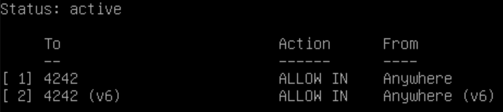
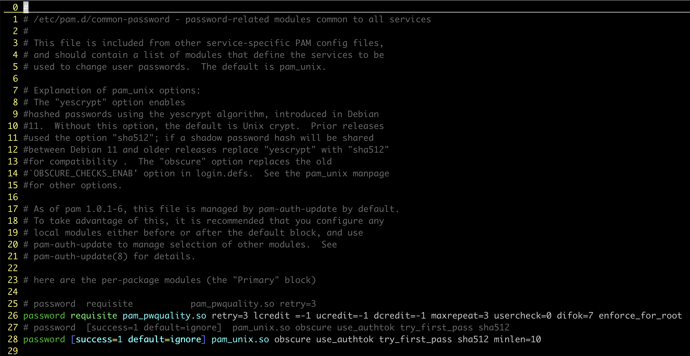
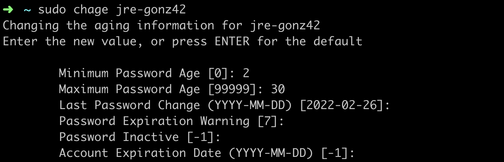
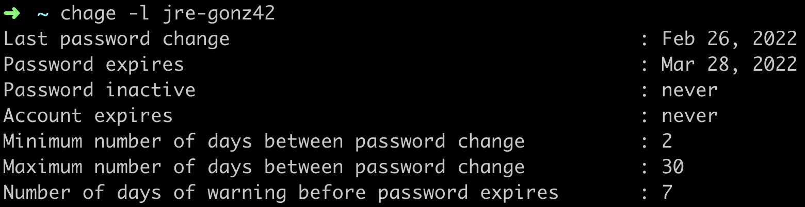
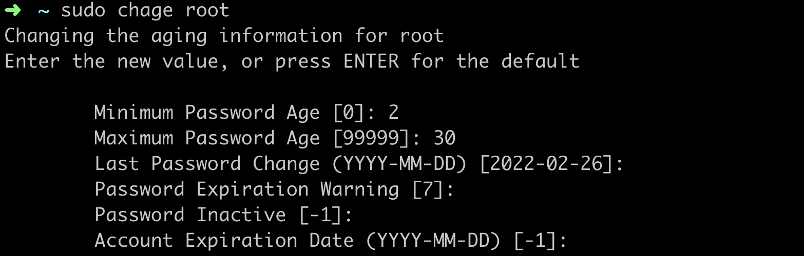
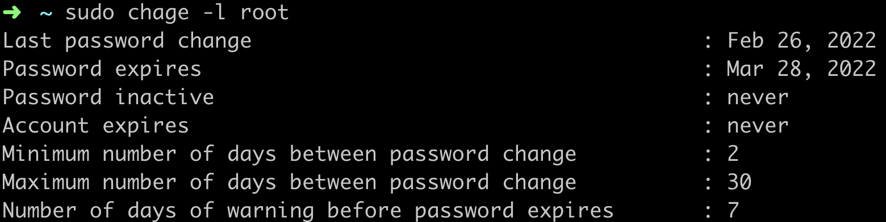

# Born2beroot:

- This guide was made for the project 42Cursus-Born2beroot.
- This guide is designed for those who already created a debian-virtual machine.

Please read the [Notes](#notes) before you start.

# Configuration:

## Sudo
Use sudo to execute superuser commands without being root. This is generally safer than using the root user.

- Install sudo:

		su -
		apt install sudo

- Add user to sudo group:

	This step will make our user belong to the sudo group.

	This step is done now to enable sudo control over SSH in the near future.

		su -
		usermod -aG sudo USER

If done correctly, using this command we should see USER:

	getent group sudo

### Give user su privileges

Open the sudoers file:

	su -
	sudo visudo

Add this line if not present:

	%sudo	ALL=(ALL) ALL

(a nice place to place it is just bellow this one)

	root	ALL=(ALL) ALL

Save and exit the file. If done correctly, you can log back to your login account to check if it works.

For example, now you should be able to execute this command without being root:

	sudo apt update


## Installing tools:
We need to install some essential tools:

### Updating and upgrading the current packages:

	sudo apt update && sudo apt upgrade -y

### Installing the tools:
- git:

		sudo apt-get install git -y

- wget or curl:
	- Both of these tools allows to download content from a given URL.
	- They are not 100% essential but they are just convenient.
	- In my case, i've downloaded wget using:

		sudo apt-get install wget -y

- Personalization tools:
	- This step is optional.
	- In my case, to work faster:
		- I've installed:
			- man:

					sudo apt-get install man -y
			- vim

					sudo apt-get install vim -y
			- zsh

					sudo apt-get install zsh -y

			- [Oh my zsh](https://ohmyz.sh/)
		- I've edited both **~/.zshrc** and **~/.vimrc** with the basic things I need to work smarter and faster.
		- Also keep in mind that these tools are light weight and easy to remove if needed, so you can remove them any time.
	- Remember that installing a graphic interface is forbidden.


## Setting up SSH service:
This step will allow us to connect to the virtual machine from a terminal of the physical machine. This is really good to copy-paste content between machines.

### Installing SSH:
		sudo apt-get update && sudo apt-get install openssh-server -y

### SSH Useful commands:

|Name|Command|Description|
|---:|:---:|:---|
|Check status ssh|``sudo systemctl status ssh``|Shows the current status of SSH server service.|
|Restart SSH service|``sudo service ssh restart``|Restart the SSH service.|
|Check port settings|``sudo grep Port /etc/ssh/sshd_config``|Allows to see the current configuration of the port settings (NOT THE SERVICE).|

### Configuration:
- [Check server status](#SSH-Useful-commands)
- [Restart SSH service](#SSH-Useful-commands)
- Change default port (22) to 4242:
	- Open with sudo the configuration file.

			sudo vim /etc/ssh/sshd_config
	- Find the line:

			#Port 22
	- Replace it with:

			Port 4242

	- Save and exit (verify the file has been edited correctly).

- Restart server:
	- If you use [Check server status](#SSH-Useful-commands) again, you will see that nothing has changed. That is because the change will not take effect until the service is restarted. Therefore, use [Restart SSH service](#SSH-Useful-commands).
	- If done correctly, it is possible to see in the log of [Check server status](#SSH-Useful-commands) that the server is now listening on 4242 port.
	- Also you can see that the ID has changed as expected.
	- Example:

			sudo systemctl status ssh | grep port
		<br>

			DATE MACHINE_NAME sshd[ID]: Server listening on 0.0.0.0 port 22.
			DATE MACHINE_NAME sshd[ID]: Server listening on :: port 22.
		<br>

			sudo service ssh restart
			sudo systemctl status ssh | grep port
		<br>

			DATE MACHINE_NAME sshd[ID]: Server listening on 0.0.0.0 port 4242.
			DATE MACHINE_NAME sshd[ID]: Server listening on :: port 4242.

## Setup firewall:
### Install UFW (Uncomplicated firewall):
		sudo apt install ufw

### UFW Useful commands:
|Name|Command|Description|
|---:|:---:|:---|
|Enable UFW|``sudo ufw enable``|Enables UFW and enables it on system startup.|
|Check UFW status|``sudo ufw status numbered``|Show the current status and rules of UFW. The param *numbered* shows the index of each one to show |
|Allow ssh|``sudo ufw allow ssh``|Allows to use ssh|
|Open port|``sudo ufw allow PORT``|Opens the given port (ei: 4242)|
|Remove port|``sudo ufw delete PORT_ID``|Removes a the given port (the number when executing ``sudo ufw status numbered``)|

### Setup UFW:
- [Enable UFW](#UFW-Useful-commands)
- [Check UFW status](#UFW-Useful-commands)
- [Allow SSH](#UFW-Useful-commands)

		sudo ufw allow ssh
- Configure port rules:
	- Open 4242:

			sudo ufw allow 4242

	- Remove all the other rules. If done correctly, you should have something like this:
	

## Allow SSH connection using Virtualbox:
- Go to VirtualBox-> Choose the VM->Select Settings
- Choose “Network”-> “Adapter 1"->”Advanced”->”Port Forwarding”
- Add a new one with the following values:

	|Name|Protocol|Host IP|Host Port|Guest IP|Guest Port|
	|:---:|:---:|:---:|:---:|:---:|:---:|
	|SSH|TCP||4242||4242|

- For this configuration to be applied, you must [Restart SSH server](#SSH-Useful-commands).

		sudo systemctl restart ssh

- That's it! Now we can connect to the virtual machine from the physical machine. From now own, we can use SSH to copy-paste content between machines.

		ssh USER@localhost -p 4242
	or

		ssh USER@127.0.0.1 -p 4242


## Set up password policy:
This step will allow us to enforce some requirements on the passwords generated from now on.
- Install the library to check password quality:

		sudo apt-get install libpam-pwquality

- Change the password quality rules:
	- Open the file:

			sudo vi /etc/pam.d/common-password

	- Find the line:

			password [success=1 default=ignore] pam_unix.so obscure sha512

		- Add the following:

				password [success=1 default=ignore] pam_unix.so obscure use_authtok try_first_pass sha512 minlen=10

	|Element|Explanation|
	|---:|:---|
	|```obscure```|Do some tests on the password: Palindrome, case sensitive...|
	|```use_authtok```|When password changing enforce the module to set the new password to the one provided by a previously stacked password module.|
	|```try_first_pass```|Before prompting the user for their password, the module first tries the previous stacked module's password in case that satisfies this module as well.|
	|```sha512```|Use this type of encryption|
	|```minlen=```N|Set the minimum amount of character to N|

	<br>

	- Configure the rest of the settings. Find the line:

			password requisite pam_pwquality.so retry=3

		- Add the following at the end:

				password requisite pam_pwquality.so retry=3 lcredit =-1 ucredit=-1 dcredit=-1 maxrepeat=3 usercheck=0 difok=7 enforce_for_root

	|Element|Explanation|
	|--:|:--|
	|```lcredit=```N|Minimum number of *lower-case* characters.|
	|```ucredit=```N|Minimum number of *upper-case* characters.|
	|```dcredit=```N|Minimum number of *digit* characters.|
	|```maxrepeat=```N|Maximun character repetition.|
	|```usercheck=```N|If the password can contain the user name in some form (1: ON, 0: OFF).|
	|```difok=```N|Minimum number of chararters that must be different from the previous password.|
	|```enforce_for_root```|This rules also apply for root users.|

	- You should end up with something like this:
		<br><br>
		
<br><br>
- Change expiration rules:
	- Open the file:

			sudo vi /etc/login.defs

	- Modify the following rules:

			PASS_MAX_DAYS 9999
			PASS_MIN_DAYS 0
			PASS_WARN_AGE 7

	|Command|Explanation|
	|---:|:---|
	|```PASS_MAX_DAYS``` N|Maximum life of a single password.|
	|```PASS_MIN_DAYS``` N|Minimum life of a single password (0 to disable).|
	|```PASS_WARN_AGE``` N|Get notified N days before remembering to change it.|

	- In my case, it ended up with:

			PASS_MAX_DAYS 30
			PASS_MIN_DAYS 2
			PASS_WARN_AGE 7

- And that's it! Just reboot the machine to apply the changes.

		sudo reboot

	From now own, every user you **create** will have to follow this rules.

- If you run now:

		chage -l USER

	and

		sudo chage -l root

	You will see that the configuration of USER's and root's password expiration has not changed. To change it:

		sudo chage USER

	and

		sudo chage root

	- Example of execution:
		<br><br>
		
		
		
		
		<br><br>

- Change passwords of both USER and root:

		passwd USER
		sudo passwd root

## Configure groups of user:
Sometimes, you may want to give some users special privileges. For example, you may want to give the user "admin" the ability to do some administrative tasks, or you may want to give the user "user" the ability to do some tasks that are not allowed to the "admin" user.

In our case, we want to define two groups: sudo and user42. The first one was the one we already configured to allow the user to execute commands as root. The second one will define that USER is a user from 42.

### Useful commands:
|Command|Explanation|
|---:|:---|
|```cut -d: -f1 /etc/passwd```|See all users|
|```sudo adduser``` USER|Creates a new user with the username USER|
|```sudo usermod -l ```USER_NEW USER_OLD|Rename the user USER_OLD to USER_NEW.|
|```sudo userdel USER```|Removes the given user. Use ```-r``` to also remove their /home directory.|
|```getent group```|See all the groups.|
|```groups```|See the groups in which the current user is in.|
|```getent group``` GROUP|Verify the users in the given group GROUP.|
|```sudo groupadd``` GROUP|Create the group GROUP.|
|```sudo groupdel``` GROUP|Delete the group GROUP.|
|```sudo usermod -aG``` GROUP USER|Add the user USER to the group GROUP|

### Configuration:
- Create the group ```user42```

		sudo groupadd user42

	- Check if created by looking at all:

			getent group

- Add the user to the required groups:

		sudo usermod -aG user42 USER

	- Check the user is in the groups ```sudo``` and ```user42``` with:

			getent group

	- **Note**: Remember that in this guide we already added the user to the sudo group. If the user is still not in this group, add them now.

## Configuring sudoers group:
- Edit the file ```/etc/sudoers```:

		sudo visudo

	Modify the file to have:

		Defaults	env_reset
		Defaults	mail_badpass
		Defaults	badpass_message="Ups! Password is wrong. Let's try again."
		Defaults	secure_path="/usr/local/sbin:/usr/local/bin:/usr/sbin:/usr/bin:/sbin:/bin:/snap/bin"
		Defaults	passwd_tries=3
		Defaults	logfile="/var/log/sudo/sudo.log"
		Defaults	log_input,log_output
		Defaults	requiretty

	|Command|Explanation|
	|---:|:---|
	|```env_reset```|Reset environment (to hide the right commands to the right people)|
	|```mail_badpass```|Send a message if authentication fails.|
	|```badpass_message="```MESSAGE```"```|Set the message to print if the authentication fails.|
	|```secure_path="```PATHS```"```|Define the PATH variable value.|
	|```passwd_tries=```N|Number of attempts to log in.|
	|```logfile="```PATH```"```|Path where the log files are stored. If the path doesn't exist, create it.|
	|```log_input,log_output```|Create those files to store logs.|
	|```requiretty```|If some non-root code is exploited (a PHP script, for example), the requiretty option means that the exploit code won't be able to directly upgrade its privileges by running sudo.)|

- Execute this command to ensure the directory ```/var/log/sudo``` exists:

		sudo mkdir -p /var/log/sudo


## Crontab configuration:
This steps will allow us to "run commands in a specific time and date".

- Installation:

		sudo apt-get update -y
		sudo apt-get install -y net-tools

- Place the script you want to execute periodically ([monitoring.sh](./monitoring.sh)) on the directory ```/usr/local/bin/```.

		sudo vi /usr/local/bin/monitoring.sh

	- Check if added correctly:

			sudo ls -l /usr/local/bin/monitoring.sh

		You should get:

			-rw-r--r-- 1 root root 3582 Feb 27 05:53 /usr/local/bin/monitoring.sh

- Modify the ```sudoers``` file to allow the script to be executed as super user without password.
	- Open the file:

			sudo visudo

	- Add the following line (a good place is under the ```%sudo ALL=(ALL:ALL) ALL``` line):

			%sudo ALL=(ALL) NOPASSWD: /usr/local/bin/monitoring.sh
- Reboot:

		sudo reboot
- Verify it works:

		sudo bash /usr/local/bin/monitoring.sh
- Open crontab

		sudo crontab -u root -e

	- It will ask you which editor to use. Select the one you prefer.

	- Add the following lines at the end of the file:

			*/10 * * * * bash /usr/local/bin/monitoring.sh

 
<br><br>

# Defense:

## Get LVM's signature:
- Go to the location where you installed your virtual machine.
- Find the file ```*.vdi```:

		find . -name "*.vdi"
- Go to the directory where the file was found.
- Run this command:

	|OS|Command|
	|---:|:---|
	|Linux|```sha1sum *.vdi```|
	|MacOS|```shasum *.vdi```|

## Hostname:
|Command|Explanation|
|---:|:---|
|```hostnamectl```|Check current hostname (among other things).|
|```sudo hostnamectl set-hostname``` HOSTNAME|Change the hostname. Also remember to update the HOSTNAME on the file ```/etc/hosts```. Needs **reboot**.|

## Theory questions:
- [Baigalaa's blog](https://baigal.medium.com/born2beroot-e6e26dfb50ac#2cb8)

## What to check:
|Command|Explanation|
|---:|:---|
|```lsblk```|Check partitions|
|```sudo aa-status```|AppArmor status|
|```getent group ```sudo|sudo group users|
|```getent group ```user42|user42 group users|
|```sudo service ssh status```|ssh status, yep|
|```sudo ufw status```|ufw status|
|```ssh``` USER@IP -p 4242```|connect to VM from your host (physical) machine via SSH|
|```sudo vi /etc/sudoers.d/```FILE|yes, sudo config file. You can ```ls /etc/sudoers.d``` first|
|```vi /etc/login.defs```|password expire policy|
|```vi /etc/pam.d/common-password```|password policy|
|```sudo crontab -l```|cron schedule|

## Log files:
The log files are located on the ```/var/log/sudo``` directory.

## Run monitoring every 30s:
- Run:

		sudo crontab -u root -e
- Add this lines:

		*/1 * * * * /path/to/monitoring.sh
		*/1 * * * * sleep 30s && /path/to/monitoring.sh
- Comment this line:

		*/10 * * * * /path/to/monitoring.sh

	into

		#*/1 * * * * /path/to/monitoring.sh
- How it works? It runs 2 times the same script every minute. However, the second one is delayed 30s to make the whole process to be executed every 30s.

## Create a new user:
- Create user USER

		sudo adduser USER
- Verify password expire info for new user

		sudo chage -l USER
- Add user to sudo and user42 groups:

		sudo adduser USER sudo
		sudo adduser USER user42

# Notes:
- When the command *su -* is present, the intention is to be executed as root. Therefore, all sections not using this command are supposed to be run without being root (as the ```USER```42).
- When following this guide, please check that the previous step has worked before going to the next.
- When editing a file, the command will use the editor **Vim**. Feel free to use the one you prefer.
- If the following words are present in a command, they would be different depending on the state of the machine:
	- DATE
	- MACHINE_NAME
	- ID
	- PORT
	- USER
	- N
	- GROUP
	- MESSAGE
	- FILE